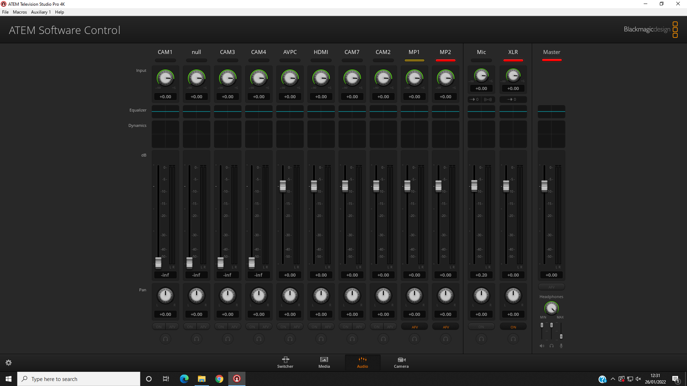

# Audio

The audio on the live stream is largely determined by the input from the sound desk (or the AV desk when a video is being played), how the vocalists in the band use their microphones, and how the congregation sings.
But there are a couple of things you can control, using the audio mixer in the ATEM software (see [PC Software](./software)).

You can also get a rough idea of the volume by looking at the programme on the multiview monitor. The volume level shows on the left and should occasionally go into the amber zone or possibly the red zone.

If you need to hear the audio side of the live stream, use the scope (described in see [Hardware](./hardware)):

1. Plug the SDI cable attached to an ATEM output into the SDI input socket of the scope.

2. Screw the scope power connector into the scope.

3. Plug the headphones into the headphone socket of the scope.

4. Turn on the scope by pressing the small power button on the side.

 (You could also plug the headphones into the PC, unmute the audio on the PC, and listen to the YouTube stream on Chrome. The big downside of this approach is that there is a considerable lag between what's happening in church and what appears on YouTube.)

Keep an eye on the chat sections of the Church Online Platform for comments about the sound quality from the host or the online congregation.

## Muting

Sometimes it's necessary to mute the sound. For instance, if the service leader asks people to talk to their neighbour, the sound should be muted to avoid picking up individual conversations (this has happened in the past - a particular risk for anyone near a microphone). Also, during the distribution of communion, it is worth muting the sound until the worship band starts playing.

To mute the sound, use the audio tab (shown below) of the ATEM switcher software on the live streaming PC. There is an XLR audio input which can be muted by clicking "on". Click it again to unmute.

## Volume

The volume is controlled by the level on the XLR audio input and the Master volume control, both on the udio tab (shown above) of the ATEM switcher software on the live streaming PC.

To increase the volume, move the XLR and Master sliders up, keeping an eye on the volume level on the multiview monitor.

To decrease the volume, move the XLR and Master sliders down.

Initially, both sliders are at about -7.5 dB.
