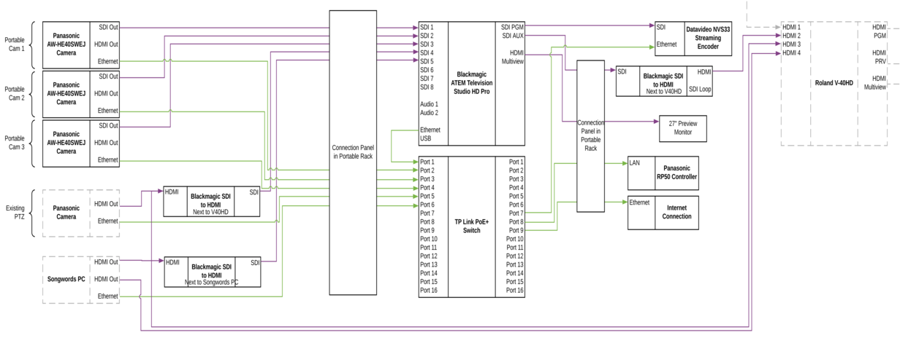

# Live Streaming Notes

Here are some notes on the CCWinch live streaming setup. See the [official site](https://www.ccwinch.org.uk/streaming) for more information.

This page is a work in progress. A version with decent highlighting of links is available [HERE](https://gist.github.com/glyn/e7b5a01fa2684bc8c0f7eef80b997f56).

## Equipment

* Cameras - AW-HE40SWEJ
  - [manual](https://pro-av.panasonic.net/manual/pdf/AW-HE40PE_Operations(SQW0456)_E.pdf)
* Cables ([SDI](https://en.wikipedia.org/wiki/Serial_digital_interface), Ethernet)
* Panasonic remote camera controller AW-RP50
  - [basic manual](https://pro-av.panasonic.net/manual/pdf/AW-RP50N(3TR006515FAA)_E.pdf)
  - [advanced manual](https://pro-av.panasonic.net/manual/pdf/AW-RP50N(3TR006602FAA)_E.pdf)
* Blackmagic ATEM TV Studio Pro 4K (video switcher)
  - [manual](https://documents.blackmagicdesign.com/uk/UserManuals/ATEM_Television_Studio_Switchers_Manual.pdf?_v=1594364410000)
  - [Blackmagic forum](https://forum.blackmagicdesign.com/)
* Datavideo NVS-34 streaming encoder
  - [manual](https://www.datavideo.com/us/file/download?id=3412)
* PC - for connecting to Facebook, etc.
* tp-link PoE+ switch TL-SL1218MP
  - [Overview of tp-link PoE](https://www.tp-link.com/uk/solution/poe/)
  - [TL-SL1218MP product description](https://www.tp-link.com/uk/business-networking/poe-switch/tl-sl1218mp/)

### Schematic Diagram

(click image to view full size)

Notes:
* (Not shown) Audio input from the sound system feeds via [XLR connectors](https://en.wikipedia.org/wiki/XLR_connector) through the connection panel in the portable rack to the video switcher.
* (Not shown) Both the camera controller and the video switcher connect to the cameras over ethernet to camera IP addresses 192.168.0.181-184 (for cameras 1-4).

## Set Up and Set Down

See the [official site](https://www.ccwinch.org.uk/streaming) for set up and set down instructions.

## During the Service

Some tips:
* Use the remote camera controller to operate cameras.
  - Choose a preset or manually zoom/pan each camera unless it is "live" (being displayed on the "program").
* Use the switcher to choose which camera to stream
  - Set the preview to the next camera, then use the "cut" button to make it live (or the "auto" button to fade, e.g. during sermons).
* To overlay words from the AV team, press the switcher "song words" button.
* To display one of the slides (back soon, end of service), select that slide under media player 1 in the ATEM software and then select "MP 1" (using either Shift key).

Questions:
* Should we capture a backup during streaming in case of an internet outage? Ans: this is probably going to be done using a SD card in the encoder and by pushing the Record and Stream buttons on the encoder at the same time. Details to be worked out.

## Video Tutorials

* [Live streaming for beginners](https://www.youtube.com/watch?v=mXTADKmZOnY) - a good place to start
* [Blackmagic video switcher](https://www.youtube.com/watch?v=mYE3LSh2ZKY) - a tour of the basic functions of the video switcher
* [Framing](https://www.youtube.com/watch?v=hC3clRr7K70) - rule of thirds, head room, and lead room

## Churchsuite Rotas

* [11am rota](https://ccwinch.churchsuite.co.uk/my/rotas/464) ([email rota with replies to the sender](mailto:ccwinch-r-ylif1x73-private@in.churchsuite.co.uk))
* [7pm rota](https://ccwinch.churchsuite.co.uk/my/rotas/465) ([email rota with replies to the sender](mailto:ccwinch-r-ehyhbcwi-private@in.churchsuite.co.uk))

Note: emailing either rota includes members of both rotas.
