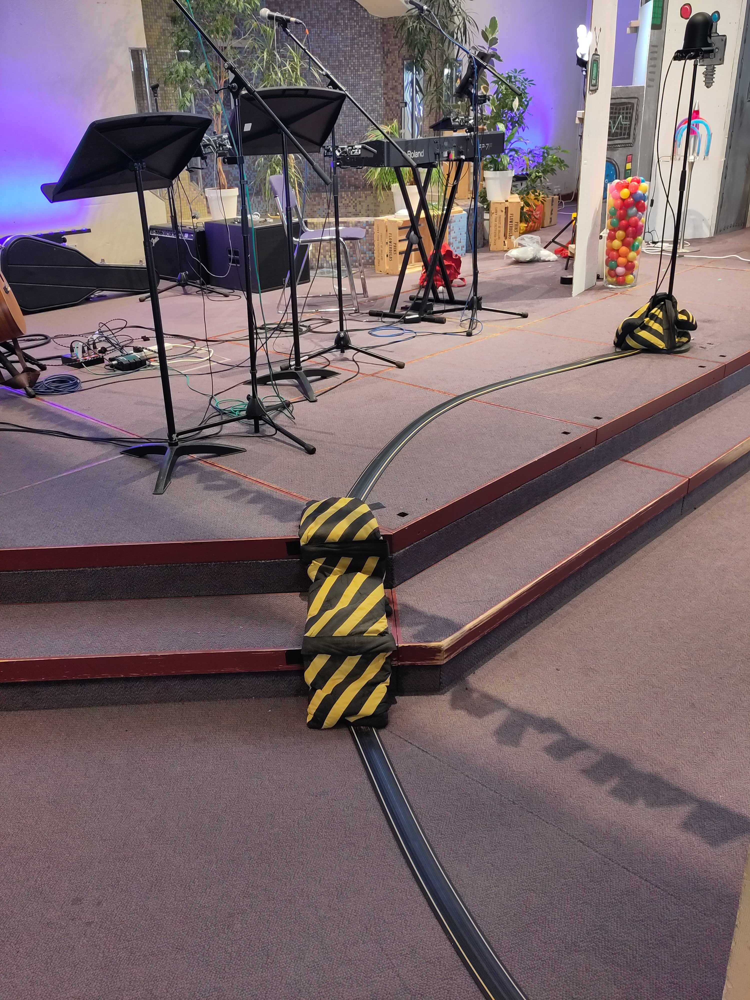

## Hardware

* Cameras - AW-HE40SWEJ
  - [manual](https://pro-av.panasonic.net/manual/pdf/AW-HE40PE_Operations(SQW0456)_E.pdf)
* Cables ([SDI](https://en.wikipedia.org/wiki/Serial_digital_interface), Ethernet)
* Panasonic remote camera controller AW-RP50
  - [basic manual](https://pro-av.panasonic.net/manual/pdf/AW-RP50N(3TR006515FAA)_E.pdf)
  - [advanced manual](https://pro-av.panasonic.net/manual/pdf/AW-RP50N(3TR006602FAA)_E.pdf)
* Blackmagic ATEM TV Studio Pro 4K (video switcher)
  - [manual](https://documents.blackmagicdesign.com/uk/UserManuals/ATEM_Television_Studio_Switchers_Manual.pdf?_v=1594364410000)
  - [Blackmagic forum](https://forum.blackmagicdesign.com/)
* Datavideo NVS-34 streaming encoder
  - [manual](https://www.datavideo.com/us/file/download?id=3412)
* PC - for connecting to Facebook, etc.
* tp-link PoE+ switch TL-SL1218MP
  - [Overview of tp-link PoE](https://www.tp-link.com/uk/solution/poe/)
  - [TL-SL1218MP product description](https://www.tp-link.com/uk/business-networking/poe-switch/tl-sl1218mp/)
* Blackmagic video assist 7" 12G HDR (combined scope/monitor/recorder/viewfinder)
  - [Product description](https://www.blackmagicdesign.com/uk/products/blackmagicvideoassist)
  - [manual](https://documents.blackmagicdesign.com/UserManuals/BlackmagicVideoAssistManual.pdf)

### Schematic Diagram

(click image to view full size)

Notes:
* (Not shown) Audio input from the sound system feeds via [XLR connectors](https://en.wikipedia.org/wiki/XLR_connector) through the connection panel in the portable rack to the video switcher.

### Camera 2 Alternative Positioning

In some situations (e.g. weddings) it is useful to position camera 2 on the stage (e.g. facing the couple being married).

To do this:
* Get a long SDI and a long ethernet cable from the livestreaming box in the store room.
* Using the ladder (often kept in the store room), plug these leads into the sockets on the column near the band. (Opposite the pillar where camera 3 plugs in.)
* Put camera 2 on the stage and run the cables across the floor and onto the stage.
* Be careful to use a cable trip protector and sand bags to avoid a trip hazard - see the photograph below.
* At the back of the live streaming cabinet, unplug the "camera 2" SDI cable from the "input 2" socket and plug the "camera L" SDI cable into that socket. Then unplug the "camera 2" ethernet cable from the "3 cam R" socket and plug the "camera L" ethernet cable into that socket.
* Afterwards, please be sure to reverse these steps so we are good for the usual Sunday setup.

### Blackmagic video assist 7" 12G HDR

The "scope" that's in the live streaming desk drawer can be used as a high quality monitor or viewfinder, as a "scope" for setting colour and white balance etc., and even to record to SD card or external drive.

It is sometimes a handy way of debugging problems. Simply connect an SDI cable from a SDI output (e.g. one of the spare outputs on the back of the rack) to the SDI input of the scope, plug in and connect the power adapter, and power on.

It might even be handy for the person using the camera controller to get a better idea of the image (but we'd need to connect the preview to the scope to avoid adjusting live images). The one downside is that it needs a tripod to sit on which it doesn't currently have, although it's fairly easy to prop up.
