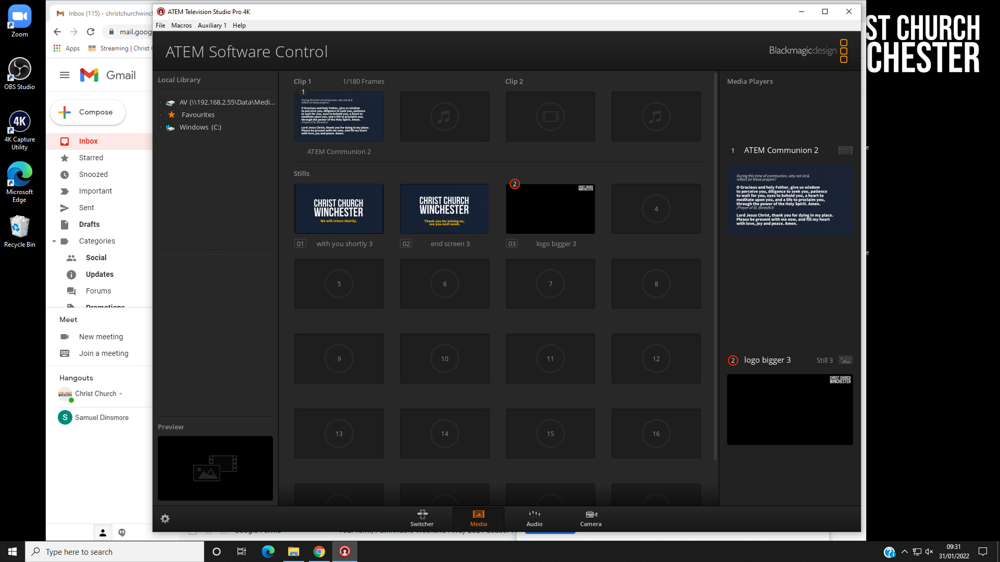

## Media Players

Media player 1 on the ATEM is used to display an image on the live stream (independently
of the AV desk).
This is useful when the stream audio and/or video has been turned off
or when the live streaming team need to make an announcement to the online congregation.
(The YouTube live chat isn't as effective since some viewers don't see the chat.)

Examples of when this may be appropriate:
* During part of a communion service.
* When copyrighted material is being used in church.
* During a baptism or dedication at the parents' request.
* During a sensitive personal testimony.

To display a given image on the live stream follow these steps:
1. Download the image onto the live streaming PC.
2. Add the image to the ATEM's media pool (see below).
3. Load the image from the media pool to media player 1 as follows:

    a. Open up the ATEM software application on the live streaming PC.

    b. Select the "Media" tab (see the screenshot at the bottom of this page).

    c. Drag the required image from the media pool in the centre to media player 1 on the right.
4. On the ATEM, preview media player 1 using either Shift key and "MP 1".
5. Cut at the appropriate time.

Notes:
* Media player 2 is dedicated to adding the Christ Church logo to the live stream and
should not be used for displaying images.
* The term "media player" might give the impression that a video can be played, but this
isn't the case. AVI, MOV, MP4, and similar formats are not supported. It is apparently possible to display "image sequences", but that seems pretty tricky.

### Adding an image to the ATEM's media pool

An image can be added to the ATEM's media pool by following these steps:
1. Download the image onto the live streaming PC.
2. Opening up the ATEM software application on the live streaming PC.
3. Select the "Media" tab (see the screenshot below).
4. Locate the image in the Local Library on the left.
5. Drag the image to one of the "stills" slots in the centre.

