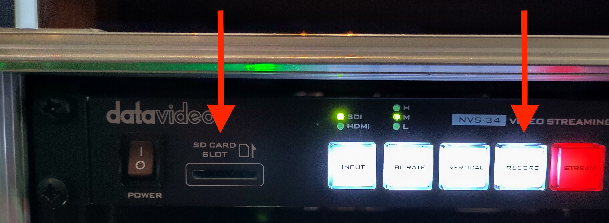
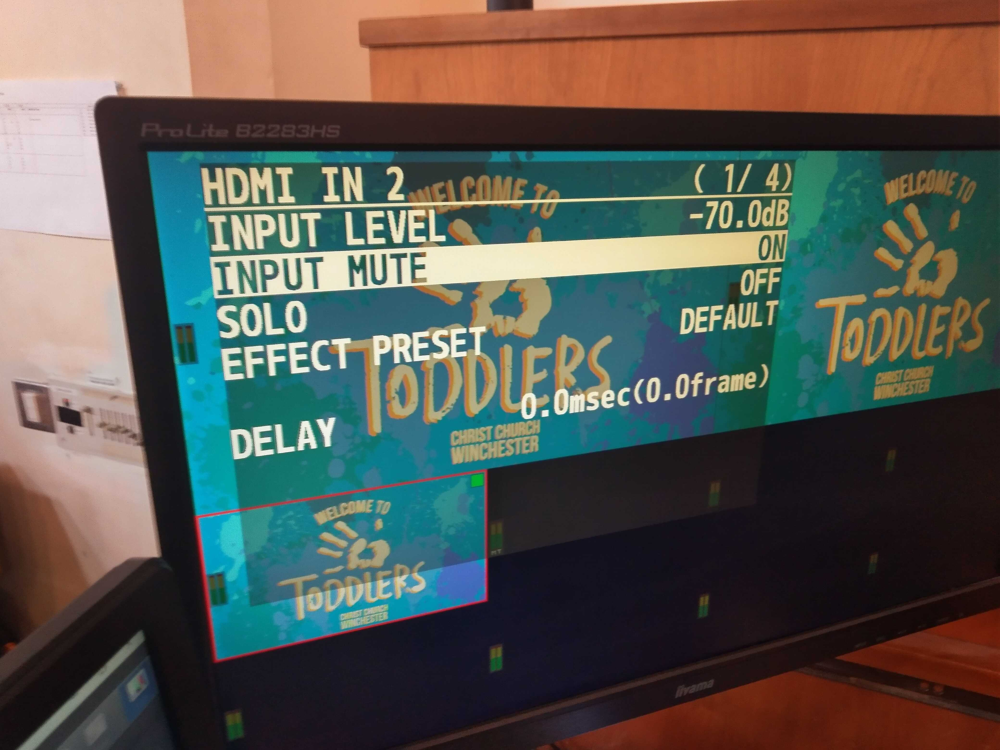

## Problem Solving

In general, try to narrow down and eventually isolate the cause of the problem. If there is a problem with one or two cameras and you can't fix it before the service starts, you may be able to make do with the remaining cameras.

Remember the all-important line from "The IT Crowd" TV series: "Have you tried turning it off and back on again?".

If you get stuck, try asking on the "Streaming" Slack channel or see if there's someone around in church who can help.

The following problems are organised by problem symptoms, each with possible explanations and fixes. If you find a problem not listed here, please tell others about it so it can be added.

## ATEM switcher is powered off ("no lights")

This is often caused by the power cable coming loose when the switcher is slid out of the rack for operation. Reach over the back of the switcher and plug the power cable back in on the right hand side.

## The multiview monitor is black

Check the monitor power and display cables are securely plugged in at both ends.

## The camera controller is powered off ("no lights")

Check the power cable hasn't come loose.

## The streaming PC display is black

Check the display power and display cables are securely plugged in at both ends.

## The encoder is powered off ("no lights")

The encoder (the topmost unit in the streaming rack) is powered by a lead inside the back of the streaming rack which may become disconnected. Ensure the mains lead is plugged in at both ends.

## The video of a camera does not appear on the multiview display

This may be because the camera has not been powered on. Use the camera controller to power all the cameras off and back on.

To see if the camera is powered on, double click the relevant camera icon on the streaming PC desktop. If you see a picture from the camera, it is powered on and the problem may be that the SDI (video) cable is not properly connected to the camera (or to the back of the rack or to the back of the ATEM switcher). Disconnect and reconnect each plug in turn to ensure it is properly connected.

## A camera cannot be controlled by the camera controller

This may be because the power-over-ethernet (PoE) cable has been plugged into the wrong socket on the affected camera. Make sure the cable is plugged into the left-hand socket. When re-plugging PoE cables, it is best to power all the cameras down first and power them back up afterwards.

## The camera controller fails to operate the cameras

The camera controller may still be in menu mode, in which case the "menu" button will be lit. Press the menu button to exit menu mode.

Alternatively, the controller may be operating a group of cameras other than group 1. You need to select group 1, thus:

* Press "menu" and then "8"
* Select "group" by turning then pressing the F1 dial
* Select "group select" by turning then pressing the F2 dial
* (I presume) Press "1" to select group 1.

Alternatively, it has been known for the camera controller to reset itself to factory defaults.
Try power-cycling the camera controller to see if this fixes the problem. If not, you may need to go to the setup menu and re-enter the IP address of each of the cameras: 192.168.0.181-184 (for cameras 1-4). The cameras also need to be set to "network" connection rather than "serial". When entering an IP address, press F2 to select each "dotted decimal" number of the IP address in turn and turn F2 to change the current number. Refer to "Changing the camera numbers" on page 34 of the *basic* manual for the camera controller (available under [Hardware](../hardware.md)) for how to set camera IP addresses. The IP address of the camera controller also needs to be set to
the correct value: 192.168.0.188. If you prefer, you can use the `RP50Tool` shortcut on the streaming PC desktop to make these changes (but beware that the tool uses the camera controller's IP address to communicate with it, so this will need to be changed as necessary).

If the camera controller cannot be made to work, try using the camera controller software ("RP50Tool") on the streaming PC.

If all else fails, you can gain some basic control of the cameras over TCP/IP using the shortcuts on the streaming PC desktop. See [Software](./software.md).

## The encoder stream button flashes red

This may be due to the encoder looking at the wrong input. Open up the encoder software on the streaming PC (there's a shortcut on the desktop, with a note of the admin password on the shortcut), select the "source" tab, and ensure that
the SDI source is selected (rather than HDMI).

When the encoder is streaming normally, the stream button should be lit red continuously.

## The "go live" icon is greyed out on YouTube

This may be due to the stream in question having already been used, even if only briefly. You
need to create a fresh stream. See [Scheduling services](./scheduling.md) for instructions.

## The live stream does not appear in the preview on YouTube

This may be because the video encoder in the rack is not yet in streaming mode (the "streaming" button needs to be lit in red). Press the streaming button on the video encoder to start streaming. Note: this isn't usually necessary, so be patient while YouTube connects to the stream as this can take up to 20-30 seconds.

## YouTube shows "no data" or "poor connection"

This may be an intermittent or permanent problem and means that the stream will not record properly.

You can record the stream to a SD card using the video encoder (NVS-34, at the top of the live streaming rack). Ensure a SD card is inserted and press and hold the
"RECORD" button for a few seconds. Release the button and, after flashing, it should light up continously red showing that the stream is being recorded to the SD card.

At the end of the service, press the "RECORD" button on the encoder again. This will end the recording
 and the MP4 file on the SD card can be uploaded to YouTube later.

If there is a temporary internet outage, it may also be possible to [create a new stream](scheduling.md) and record to that.

## The internet is not accessible from the live streaming PC

Ensure the AV desk PC is switched on (it doesn't need to be logged in). Also ensure that the
network splitter mains switch is turned on - this is next to the AV desk mains switch (on the wall, low down, at the right hand side of the sound desk).

Alternatively, the antivirus/firewall software on the streaming PC may be out of date. Temporarily disable the antivirus/firewall from the network settings to work around this.

Another cause of losing internet (across the whole site!) is if the camera controller has lost its settings and set its IP address to the default of 192.168.0.10 which conflicts with the church's main internet gateway.
See [The camera controller fails to operate the cameras](./problems.md#the-camera-controller-fails-to-operate-the-cameras) for how to set the camera controller settings back to what they should be.

## Poor sound quality on the live stream

Sometimes the host or a member of the online congregation will point out that the sound is
poor or that there is a specific problem with the sound. Check the sound level on the "live" panel of the multiview monitor. If it seems too low, check with the sound desk operator that the sound desk is correctly set up. If it's still too low, you can boost the volume by using
the ATEM switcher software on the live streaming PC. In the audio tab there is a master volume slider and a xlr slider which can be increased.

## Robotic sound when the live stream is displayed on screens in church

Not everyone can hear this problem when it occurs.

The solution is to use the Roland V-8HD menu to Mute HDMI input #2 from the ATEM (and turn the level down to -70dB to make sure). The menu is shown in the photograph below:

For details, see [this issue](https://github.com/ccwinch/live-streaming-tech-notes/issues/7).

## Problems with the song words or AV input ("camera 5")

The AV and live streaming desks may have been powered up in the wrong order. Power down the AV and live streaming desks and then power up the live streaming desk and PC before powering up the AV desk and PC. This ensures that the graphics card in the AV PC detects the correct inputs.

There is also a Microsoft Word document on the AV PC which describes the display arrangement ("3, 4, 1|2", where displays 1 and 2 are mirrored) and EasyWorship settings.

## YouTube connection problems

If the live stream fails or YouTube reports buffering problems for more than a second or two, there may be an issue with the internet connection. There's not much you can do about this, but please report it so we can look into it.
