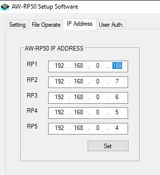
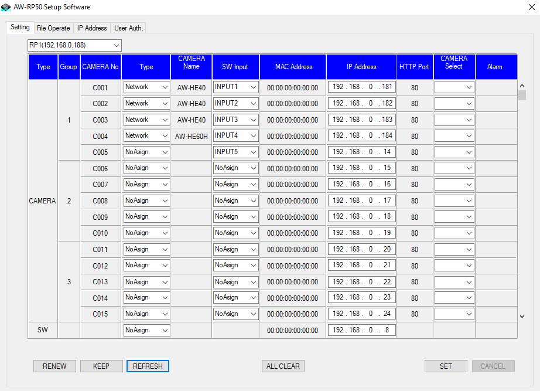
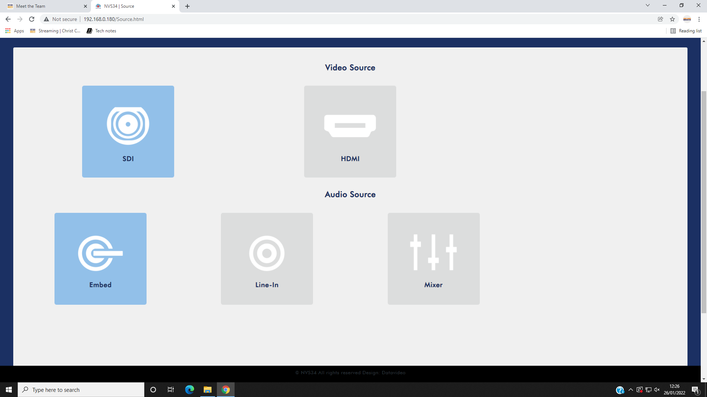
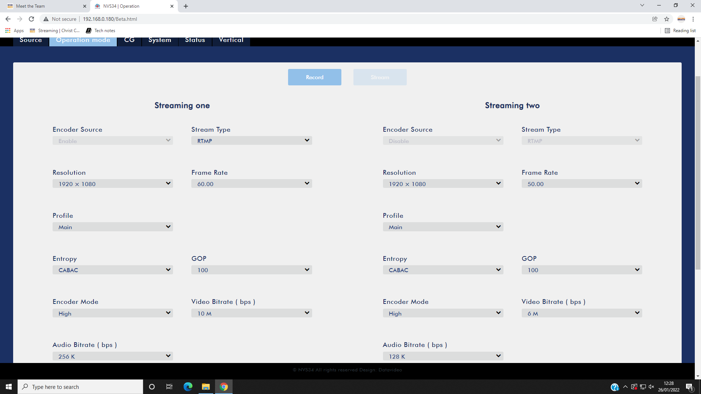
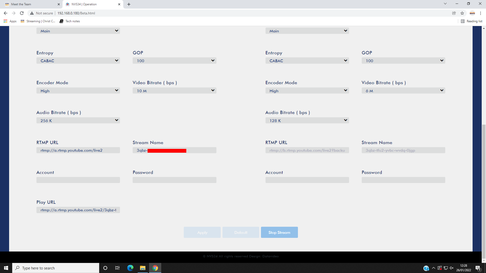
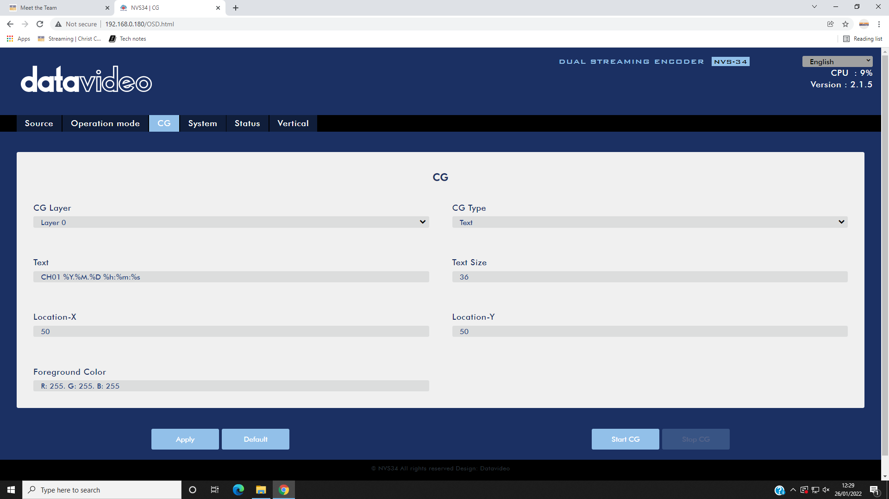
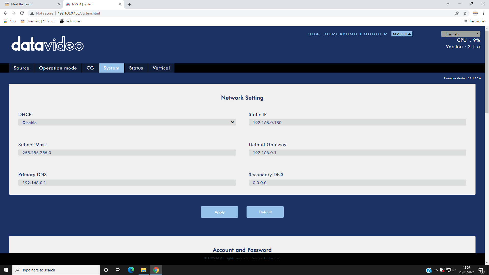

# Settings

## Network IP addresses

| Device                          | IP address        |
|---------------------------------|-------------------|
| Datavideo encoder               | 192.168.0.180     |
| Camera 1                        | 192.168.0.181     |
| Camera 2                        | 192.168.0.182     |
| Camera 3                        | 192.168.0.183     |
| Camera 4                        | 192.168.0.184     |
| Panasonic Camera Controller     | 192.168.0.188     |
| Blackmagic ATEM                 | 192.168.0.189     |

## Panasonic remote camera controller AW-RP50

Launch the RP50Tool program (see [Software](./software.md)) and set the RP1 IP address to 192.168.0.188[^ccip] on the IP Address tab and click the "Set" button. See the image below.

Then go to the Setting tab and click the "Refresh" button. The IP addresses of the cameras should be as in the screenshot below. If necessary, update the settings and click the "SET" button.

(click image to view full size)

[^ccip]: If the IP address of the camera controller has changed, you'll need to use that IP address instead.

## Datavideo NVS-34 streaming encoder

Source tab:

(click image to view full size)

Operation mode tab:

Note: the RTMP URL and Stream Name correspond to the YouTube stream's Stream URL and Stream key, respectively.

(click image to view full size)

(click image to view full size)

CG tab:

(click image to view full size)

System tab:

(click image to view full size)

