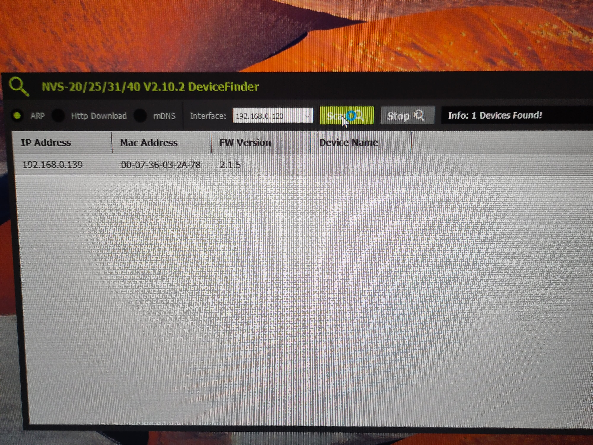
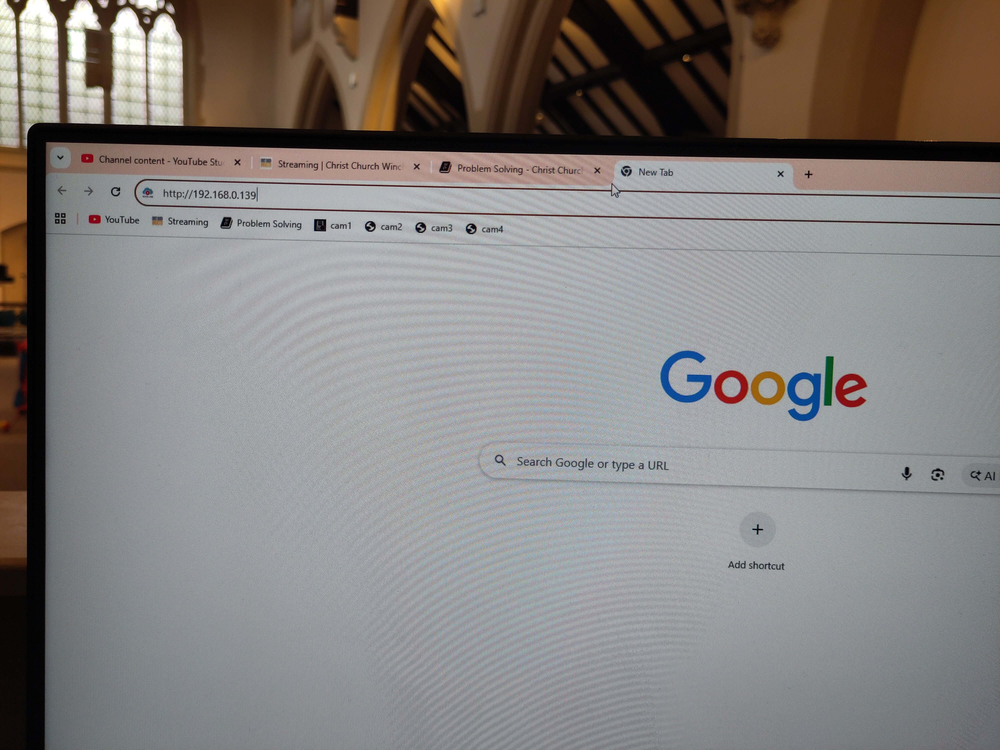
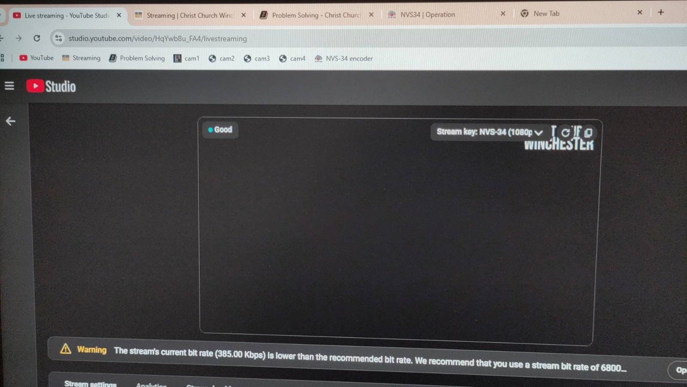
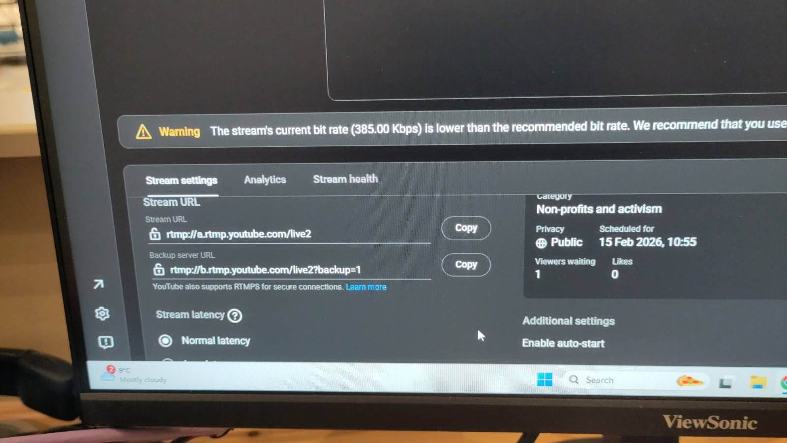

# Settings

## Network IP addresses

| Device                          | IP address        |
|---------------------------------|-------------------|
| Datavideo encoder               | 192.168.0.139     |
| Camera 1                        | 192.168.0.181     |
| Camera 2                        | 192.168.0.182     |
| Camera 3                        | 192.168.0.183     |
| Camera 4                        | 192.168.0.184     |
| Panasonic Camera Controller     | 192.168.0.188     |
| Blackmagic ATEM                 | 192.168.0.189     |

## Panasonic remote camera controller AW-RP50

Launch the RP50Tool program (see [Software](./software.md)) and set the RP1 IP address to 192.168.0.188[^ccip] on the IP Address tab and click the "Set" button. See the image below.

Then go to the Setting tab and click the "Refresh" button. The IP addresses of the cameras should be as in the screenshot below. If necessary, update the settings and click the "SET" button.

(click image to view full size)

[^ccip]: If the IP address of the camera controller has changed, you'll need to use that IP address instead.

## Datavideo NVS-34 streaming encoder

If the above IP address is not correct, find the encoder IP address by running the DeviceFinder application on the live streaming PC.
Select the interface starting with `192` and then click the "Scan" button:

(click image to view full size)

The encoder IP address should then be found:

(click image to view full size)

You can then access the encoder settings by entering the IP address into Google Chrome, e.g.
`http://192.168.0.139` (note this link uses `http` rather than `https`).

(click image to view full size)

Alternatively, there may be a bookmark for this link, on Chrome's bookmark bar, entitled "NVS-34 encoder".

Use the default account of "admin" and password "000000".

Source tab:

(click image to view full size)

Operation mode tab:

Click the "Stream" button to access or change the streaming settings.

The encoder uses Stream Type RTMP for both the primary stream ("Streaming one") and backup stream ("Streaming two").

Most of the settings take the default values, except for the following settings which come from YouTube:

* RTMP URL (also known as "Stream URL")
* Stream Name (also known as "Stream Key")
* Account: `christchurchwinchesteruk@gmail.com`
* Password: the Google password for the above account.

The RTMP URL and Stream Name correspond to the YouTube stream's Stream URL and Stream key, respectively.
These can be found on YouTube by previewing a stream (as usual when setting up for streaming).

The stream key, which is the same for both primary and backup streams, is displayed at the top of the preview with a "copy" icon next to it:

(click image to view full size)

The stream URLs are found further down the same page, with "Copy" buttons next to them:

(click image to view full size)

The stream URL is for the primary stream; the backup server URL is for the backup stream.

Once the settings have been entered in the following fields on the Operations tab, click "Apply" and then "Start stream".

(click image to view full size)

(click image to view full size)

CG tab:

(click image to view full size)

System tab:

(click image to view full size)

