# Settings

## Network IP addresses

| Device                          | IP address        |
|---------------------------------|-------------------|
| Camera 1                        | 192.168.0.181     |
| Camera 2                        | 192.168.0.182     |
| Camera 3                        | 192.168.0.183     |
| Camera 4                        | 192.168.0.184     |
| Panasonic Camera Controller     | 192.168.0.188     |
| Blackmagic ATEM                 | 192.168.0.189     |

## Blackmagic ATEM TV Studio Pro 4K settings

This section describes how to use the ATEM Television Studio Pro 4K application on the live streaming PC to reload the ATEM settings.

Start the application and connect to the ATEM TV Studio Pro 4K (**not** the "ATEM in person" device, as this belongs to the AV desk).

If the application does not connect to the ATEM, this may be due to the ATEM switcher having the wrong IP address. To set the correct IP address (`192.168.0.189`), use the menu and set buttons at the top right of the ATEM to navigate to Settings/IP Address and to change its contents:

[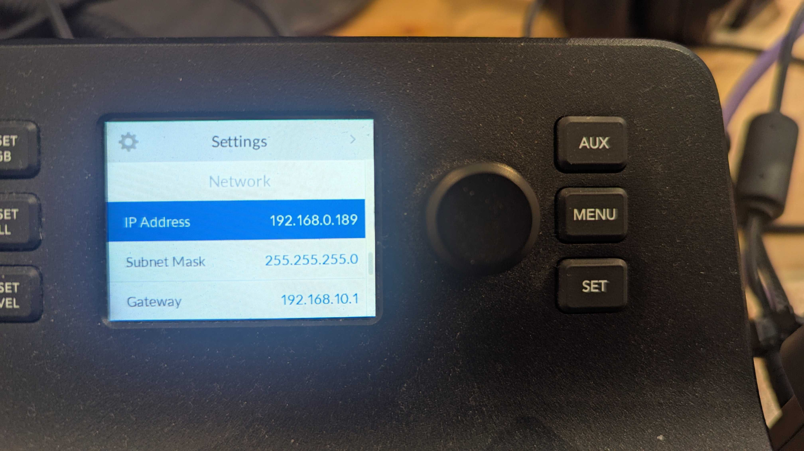](./images/ATEMIP.jpg)

Once you've set the IP address, connect to the ATEM using the PC application.

Once you've connected to the live streaming ATEM, you can reload the settings as follows:

1. Click File -> Restore.
2. Choose the most recent set of settings saved in a .xml file in the Desktop folder.
**Be careful to choose the settings for the ATEM TV Studio Pro 4K (rather than the "ATEM in person" device used by the AV desk).**
3. Click Restore.
4. Click File -> Save Startup State so these settings are loaded next time the ATEM is powered up.

## Panasonic remote camera controller AW-RP50

Launch the RP50Tool program (see [Software](./software.md)) and set the RP1 IP address to 192.168.0.188[^ccip] on the IP Address tab and click the "Set" button. See the image below.

[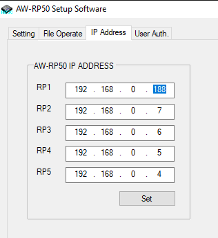](./images/RP50IPaddress.png)

Then go to the Setting tab and click the "Refresh" button. The IP addresses of the cameras should be as in the screenshot below. If necessary, update the settings and click the "SET" button.

[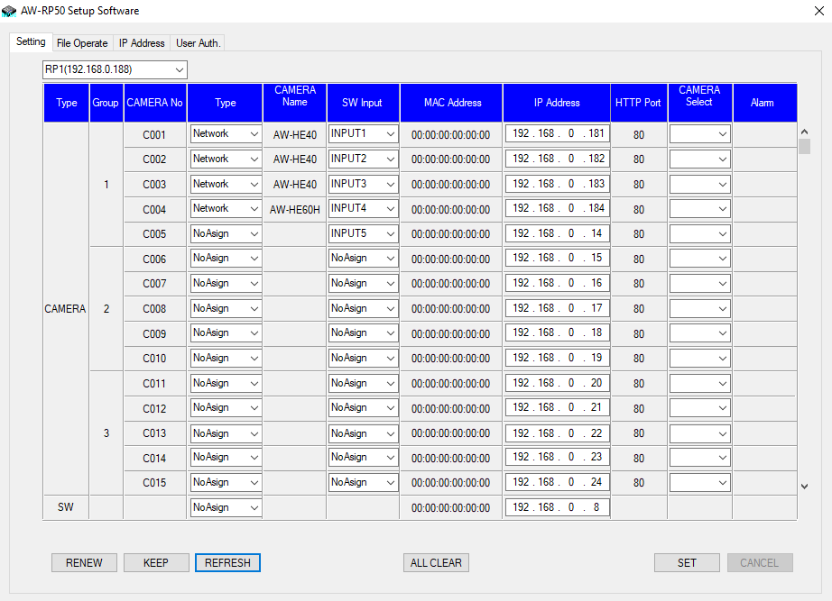](./images/RP50setting.png)
(click image to view full size)

[^ccip]: If the IP address of the camera controller has changed, you'll need to use that IP address instead.

## Datavideo NVS-34 streaming encoder settings

This section describes how to configure the encoder settings using Chrome to access the encoder's website.

The following sections describe how to find the encoder's homepage, log in, and configure the encoder settings.

### Finding the encoder's homepage

First you need to find the encoder's IP address by running the DeviceFinder application on the live streaming PC.
Select the interface starting with `192` and then click the "Scan" button:

[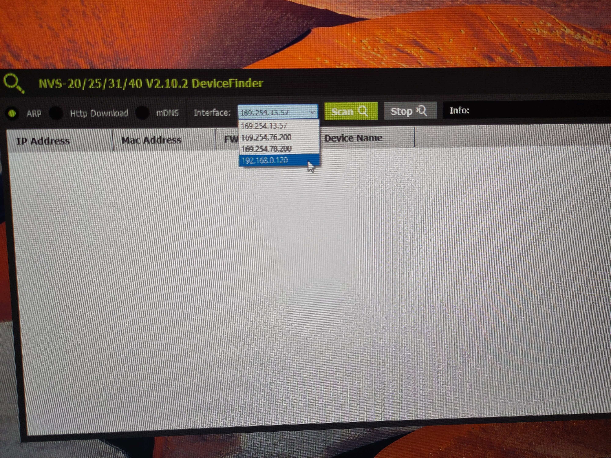](./images/device-finder-scan.jpg)
(click image to view full size)

The encoder IP address should then be found:

[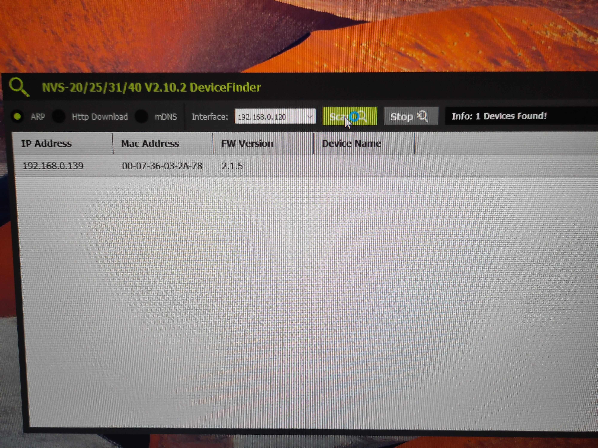](./images/device-finder-found.jpg)
(click image to view full size)

You can then access the encoder settings by entering the IP address into Google Chrome, e.g.
`http://192.168.0.139` (note this link uses `http` rather than `https`).

[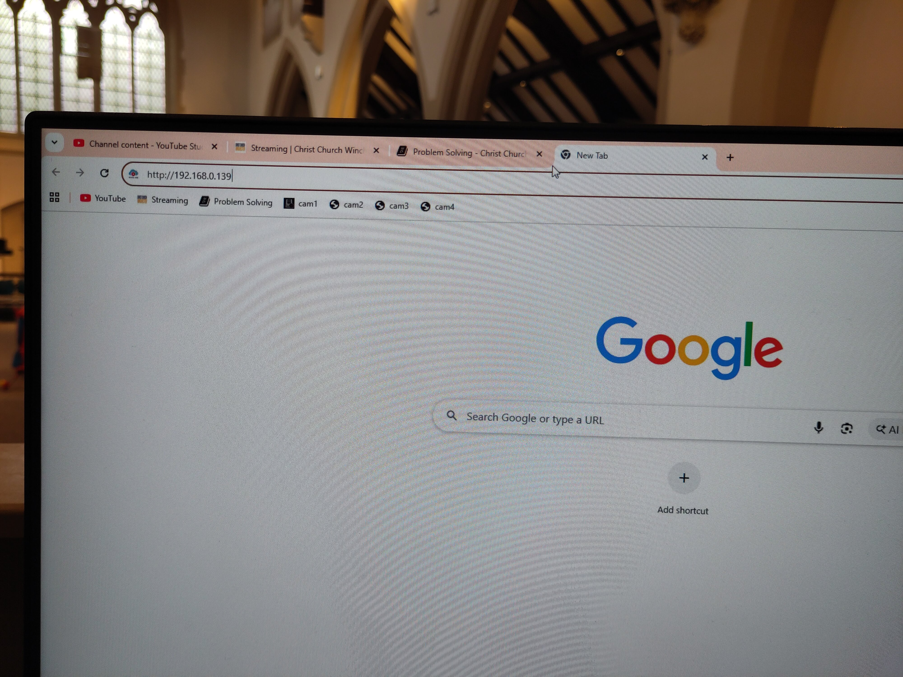](./images/chrome-encoder.jpg)
(click image to view full size)

### Logging in

Log in using the default account of "admin" and password "000000".

### Configuring the encoder settings

Once you have logged in to the encoder's homepage, you'll see a number of tabs.
Click on the Operation mode tab and then click the "Stream" button to access or change the streaming settings.

The encoder uses Stream Type RTMP for both the primary stream ("Streaming one") and backup stream ("Streaming two").

Most of the settings take the default values, except for the following settings which come from YouTube:

* RTMP URL (also known as "Stream URL")
* Stream Name (also known as "Stream Key")
* Account: `christchurchwinchesteruk@gmail.com`
* Password: the Google password for the above account.

The RTMP URL and Stream Name correspond to the YouTube stream's Stream URL and Stream key, respectively.
These can be found on YouTube by previewing a stream (as usual when setting up for streaming).

The stream key, which is the same for both primary and backup streams, is displayed at the top of the preview with a "copy" icon next to it:

[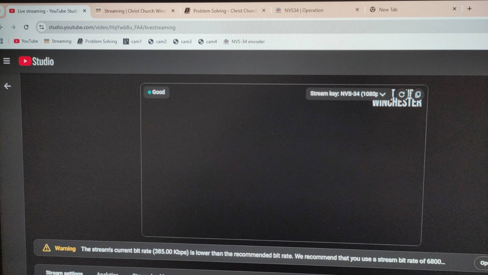](./images/stream-key.jpg)
(click image to view full size)

The stream URLs are found further down the same page, with "Copy" buttons next to them:

[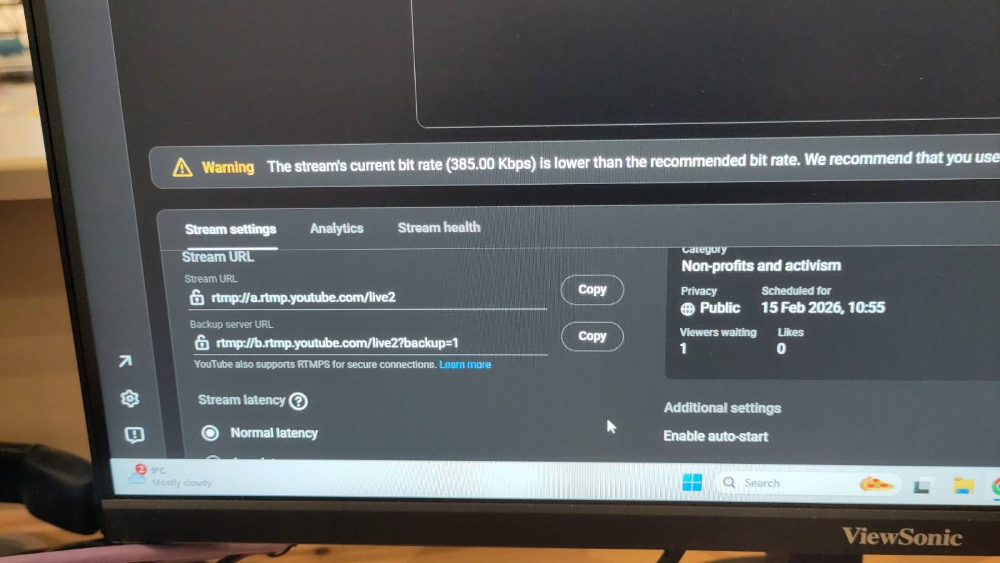](./images/stream-url.jpg)
(click image to view full size)

The stream URL is for the primary stream; the backup server URL is for the backup stream.

Once the settings have been entered in the following fields on the Operations tab, click "Apply" and then "Start stream".

[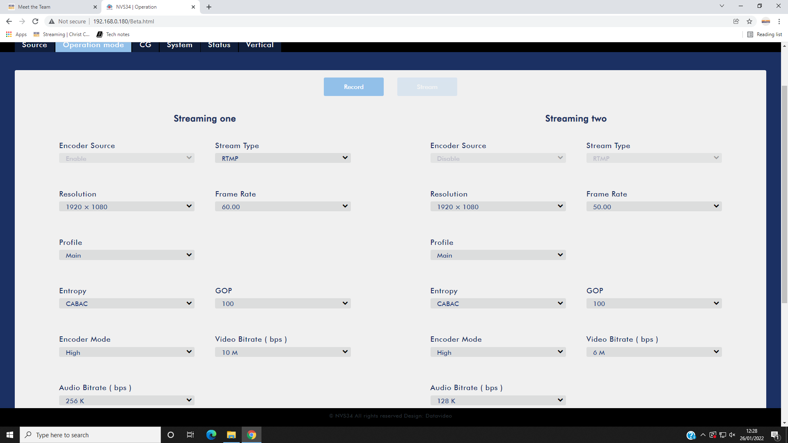](./images/NVS34Operationtop.png)
(click image to view full size)

[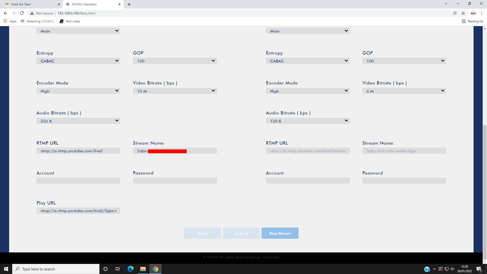](./images/NVS34Operationbottom.png)
(click image to view full size)

You probably won't need to change any other settings, but here are screenshots of some of the other tabs just in case.

CG tab:

[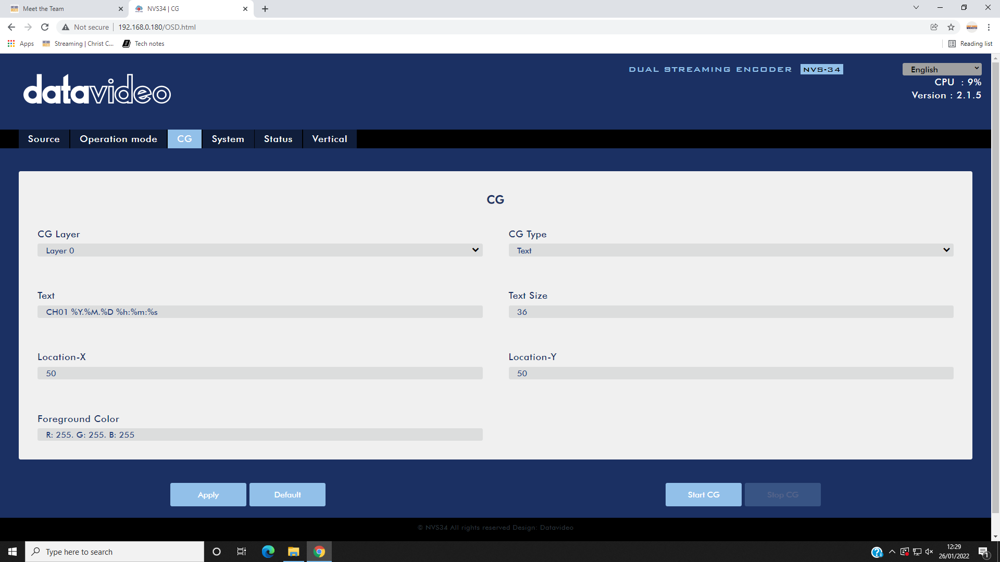](./images/NVS34CG.png)
(click image to view full size)

System tab:

The screenshot below is out of date. The encoder needs to be configured with dhcp enabled.
**The encoder no longer works when a static IP address is used.**

[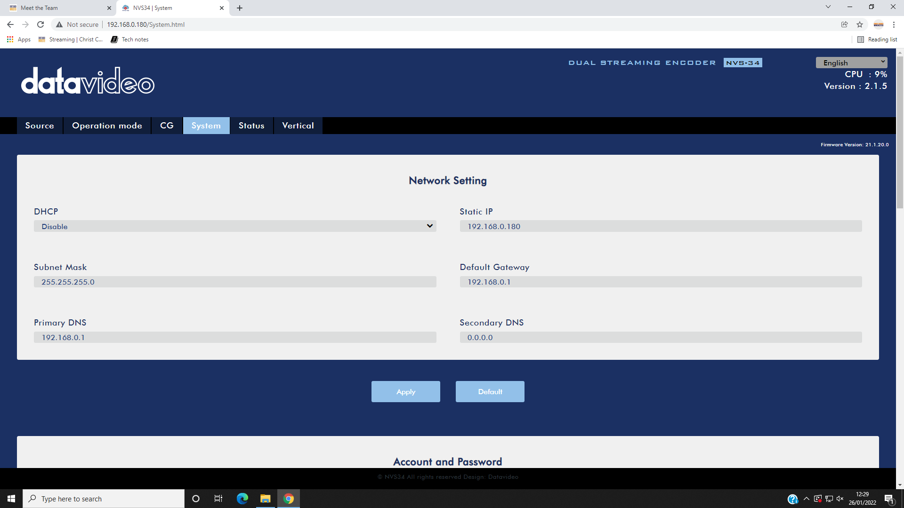](./images/NVS34System.png)
(click image to view full size)
