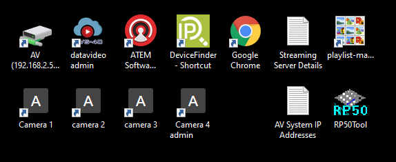

# PC Software

The streaming PC desktop has various shortcuts for useful programs.

* Datavideo NVS-34 streaming encoder software
  - Log in using "admin" and the password in the shortcut
  - See [Settings](./settings.md) for its normal settings
* Blackmagic ATEM TV Studio Pro 4K (video switcher) software
* Google Chrome
* playlist-manager
  - An application to organise the catch-up playlist on YouTube
  - Run it after each service and, if it prompts for authorisation and launches a browser, select the account christchurchwinchesteruk@gmail.com and follow the instructions to allow the application to view/modify the playlist
* Camera 1 - direct access to camera 1 over TCP/IP
* Camera 2 - direct access to camera 2 over TCP/IP
* Camera 3 - direct access to camera 3 over TCP/IP
* Camera 4 - direct access to camera 4 over TCP/IP
* RP50Tool - software for the Panasonic remote camera controller AW-RP50
  - See [Settings](./settings.md) for its normal settings
